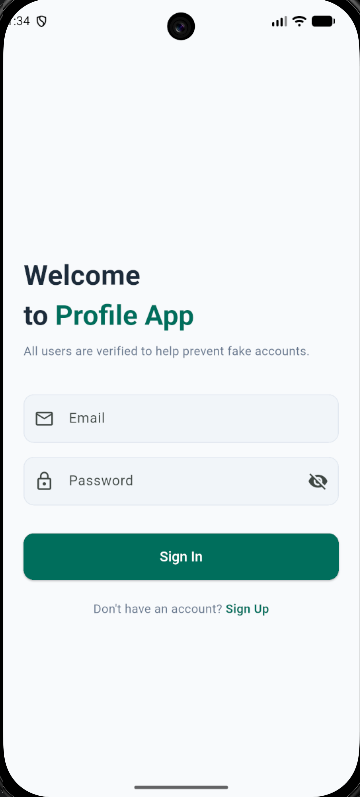
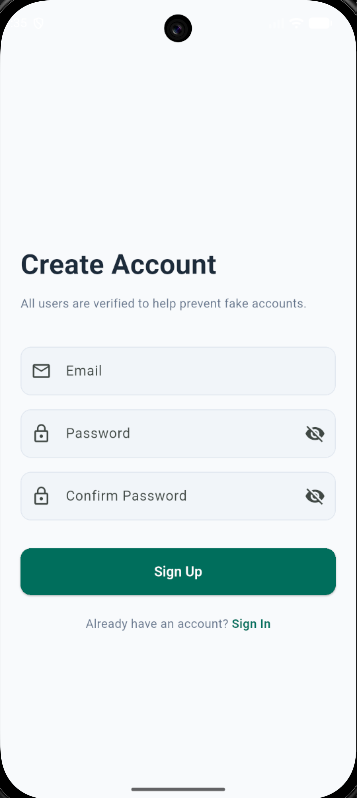
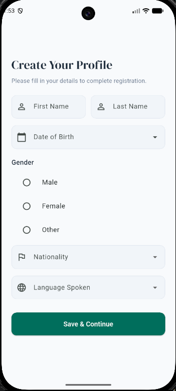
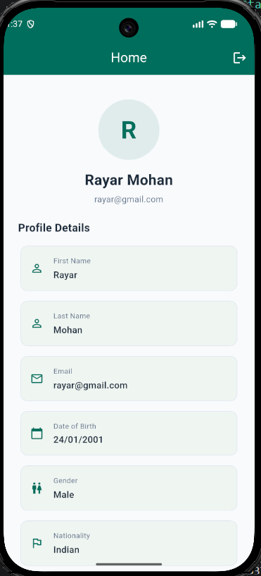
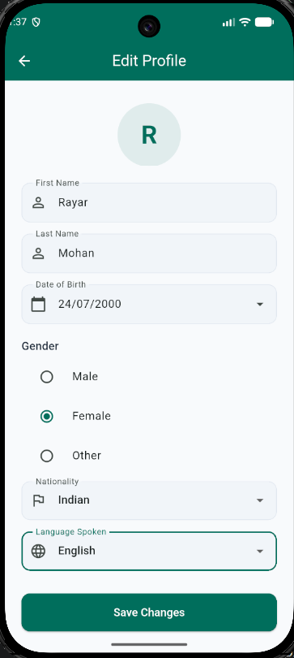

# Profile Data App

A Flutter application for user authentication and profile management, built with **Clean Architecture**, **BLoC state management**, and **Firebase** backend services.

Users can sign up, fill in personal details, view their profile on the home screen, and edit/update information at any time.

---

## Features

- **Email/Password Authentication** — Sign up and sign in with Firebase Auth
- **Profile Details Collection** — First name, last name, date of birth, gender, nationality, language
- **Firestore CRUD** — Create, read, update, and delete user profiles in Cloud Firestore
- **Home Dashboard** — Displays all saved user details with avatar
- **Edit Profile** — Update any field and persist changes to Firestore
- **Logout** — Secure sign out with confirmation dialog
- **Auth Persistence** — Auto-login on app restart if session exists

---

## Screenshots

<table>
  <tr>
    <td align="center"><strong>Login</strong></td>
    <td align="center"><strong>Sign Up</strong></td>
    <td align="center"><strong>Complete Profile</strong></td>
  </tr>
  <tr>
    <td></td>
    <td></td>
    <td></td>
  </tr>
  <tr>
    <td align="center"><strong>Home</strong></td>
    <td align="center"><strong>Edit Profile</strong></td>
    <td></td>
  </tr>
  <tr>
    <td></td>
    <td></td>
    <td></td>
  </tr>
</table>

---

## Architecture

This project follows **Clean Architecture** with a **feature-based folder structure** and **BLoC** (Business Logic Component) as the state management pattern.

```
lib/
├── main.dart                              # Entry point, Firebase init, DI setup
├── core/
│   ├── di/injection_container.dart        # get_it service locator
│   ├── router/app_router.dart             # Centralized route definitions
│   └── theme/app_theme.dart               # Colors, button/input themes
└── features/
    ├── auth/
    │   ├── data/
    │   │   ├── models/user_model.dart         # Firestore data model
    │   │   └── repositories/auth_repository.dart  # Firebase Auth operations
    │   ├── bloc/
    │   │   ├── auth_bloc.dart                 # Auth business logic
    │   │   ├── auth_event.dart                # Events (SignIn, SignUp, SignOut)
    │   │   └── auth_state.dart                # States (Loading, Authenticated, Error)
    │   └── presentation/
    │       ├── screens/
    │       │   ├── login_screen.dart          # Email + password login
    │       │   └── signup_screen.dart         # Email + password + confirm
    │       └── widgets/auth_header.dart       # Reusable auth header widget
    ├── home/
    │   ├── data/repositories/profile_repository.dart  # Firestore CRUD
    │   ├── bloc/
    │   │   ├── profile_bloc.dart              # Profile business logic
    │   │   ├── profile_event.dart             # Events (Load, Update, Delete)
    │   │   └── profile_state.dart             # States (Loaded, Error, Deleted)
    │   └── presentation/
    │       └── screens/home_screen.dart       # User data display + logout
    └── profile/
        └── presentation/
            └── screens/
                ├── profile_details_screen.dart  # Post-signup details form
                └── profile_screen.dart          # Edit profile form
```

### Layer Responsibilities

| Layer | Responsibility |
|-------|---------------|
| **data** | Models, repositories, API/Firebase calls |
| **bloc** | Business logic, event handling, state emission |
| **presentation** | UI screens, widgets, user interaction |
| **core** | Shared utilities, theme, routing, DI |

---

## Tech Stack

| Category | Package | Purpose |
|----------|---------|---------|
| **State Management** | `flutter_bloc` ^9.1.1 | BLoC pattern for predictable state |
| **Equatable** | `equatable` ^2.0.7 | Value equality for events and states |
| **Dependency Injection** | `get_it` ^8.0.3 | Service locator for loose coupling |
| **Firebase Auth** | `firebase_auth` ^5.5.4 | Email/password authentication |
| **Cloud Firestore** | `cloud_firestore` ^5.6.9 | User profile CRUD operations |
| **Firebase Core** | `firebase_core` ^3.12.1 | Firebase initialization |
| **Fonts** | `google_fonts` ^6.2.1 | Custom typography |
| **Linting** | `flutter_lints` ^6.0.0 | Code quality rules |

---

## Prerequisites

- **Flutter SDK** >= 3.11.5
- **Dart SDK** >= 3.11.5
- **Android Studio** or **VS Code** with Flutter plugin
- **Firebase account** with a project created
- **Android**: `google-services.json` in `android/app/`
- **iOS**: `GoogleService-Info.plist` in `ios/Runner/`

---

## Setup Instructions

### 1. Clone the Repository

```bash
git clone https://github.com/Rayarmohan/Profile-UserData.git
cd profile_data_app
```

### 2. Install Dependencies

```bash
flutter pub get
```

### 3. Firebase Configuration

#### Create a Firebase Project

1. Go to [Firebase Console](https://console.firebase.google.com)
2. Click **Add project** and follow the setup wizard

#### Register Your Android App

1. In Firebase Console, click the **Android** icon
2. Enter package name: `com.profiledata.profileapp`
3. Download `google-services.json`
4. Place it in `android/app/google-services.json`

#### Register Your iOS App

1. In Firebase Console, click **Add app > iOS+**
2. Enter bundle ID: `com.profiledata.profileapp`
3. Download `GoogleService-Info.plist`
4. Place it in `ios/Runner/GoogleService-Info.plist`

#### Enable Firebase Services

1. **Authentication** > Get started > Enable **Email/Password**
2. **Cloud Firestore** > Create database > Start in **test mode** > Choose closest region

### 4. Run the App

```bash
# Check for connected devices
flutter devices

# Run on Android
flutter run

# Run on iOS
cd ios && pod install && cd ..
flutter run

# Run on specific device
flutter run -d <device-id>
```

### 5. Build Release APK (Android)

```bash
flutter build apk --release
```

Output: `build/app/outputs/flutter-apk/app-release.apk`

### 6. Build Release IPA (iOS)

```bash
flutter build ios --release
```

Then archive and distribute through Xcode.

---

## Firestore Data Structure

```
users (collection)
  └── {uid} (document)
        ├── uid: string
        ├── email: string
        ├── firstName: string
        ├── lastName: string
        ├── dateOfBirth: string (DD/MM/YYYY)
        ├── gender: string
        ├── nationality: string
        ├── languageSpoken: string
        └── createdAt: string (ISO 8601)
```

---

## User Flow

```
App Launch
    │
    ├─ User signed in + profile complete → Home Screen
    ├─ User signed in + no profile     → Profile Details Screen
    └─ No user signed in               → Login Screen
                │
                ├─ Login → Home Screen
                │
                └─ Sign Up → Profile Details → Home Screen
                                    │
                                    └─ Home ←→ Edit Profile (update & save)
```

---

## Platform Targets

| Platform | Status |
|----------|--------|
| Android | Supported |
| iOS | Supported |

---

## License

This project is for educational purposes. Feel free to use and modify.
